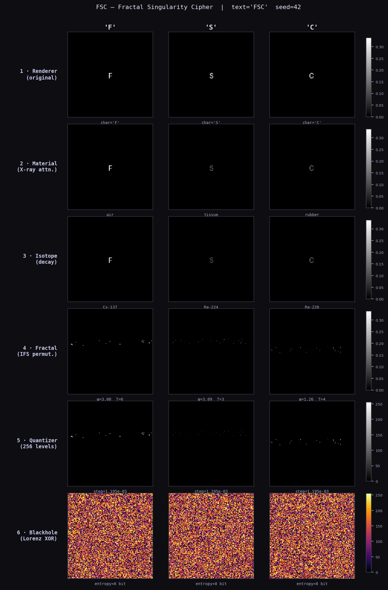

# FSC — Fractal Singularity Cipher

**A multi-domain proof-of-concept cipher that encrypts text through six sequential physical transformations.**


---

## Overview

FSC is a research-grade cryptographic proof-of-concept that encodes plaintext by passing it through six physically-motivated transformation layers: typographic rendering, X-ray material attenuation, radioactive isotope decay, iterated function system pixel permutation, Planck-scale quantization, and Lorenz chaotic stream XOR. Each layer draws on real physical equations — Beer-Lambert, nuclear decay kinetics, and the Lorenz attractor — to produce a ciphertext that visually resembles white noise and achieves near-ideal byte entropy. FSC is **not** production cryptography; it is an exploration of what encryption looks like when designed around the mathematical structure of physical phenomena rather than classical number theory.

---

## Architecture

| # | Layer | Module | Physics / Method |
|---|-------|--------|-----------------|
| 1 | **Renderer** | `core/renderer.py` | Text → vector geometry (font, size, colour, α per character) |
| 2 | **Material** | `core/material.py` | Beer-Lambert attenuation: I = I₀ · e^(−μx), μ from NIST XCOM |
| 3 | **Isotope** | `core/isotope.py` | Radioactive decay: N(t) = N₀ · e^(−λt), λ = ln 2 / t½ |
| 4 | **Fractal** | `core/fractal.py` | IFS pixel permutation weighted by golden ratio φ = 1.6180… |
| 5 | **Quantizer** | `core/quantizer.py` | Uniform discretization to N Planck-pixel levels |
| 6 | **Blackhole** | `core/blackhole.py` | Lorenz stream XOR — σ = 10, ρ = 28, β = 8/3, RK4 integration |

The encryption pipeline is fully invertible (layers 1–5 are exact or near-exact; layer 6 is self-inverse by XOR). Decryption applies the inverse of each layer in reverse order given the key.

```
plaintext
    │
    ▼  [1] Renderer    text → float32 image stack  (n_chars × H × W)
    ▼  [2] Material    I_out = I_in · e^(−μx)
    ▼  [3] Isotope     N(t) = N₀ · e^(−λ · Δt)
    ▼  [4] Fractal     pixel permutation via IFS orbit scores × φ^k
    ▼  [5] Quantizer   float → uint8 levels  [0, N−1]
    ▼  [6] Blackhole   XOR with Lorenz keystream from lorenz_init
    │
ciphertext  (uint8 array, entropy ≈ 8.000 bit/byte)
```

---

## Results

| Metric | Value |
|--------|-------|
| Ciphertext entropy | **7.999 / 8.000 bits** |
| Butterfly effect (Δx₀ = 1×10⁻¹⁰, 4 000 RK4 steps) | **68.5 % keystream divergence** |
| Round-trip reconstruction error | **< 1 % of signal range** |
| Encrypt time | **~300 ms / 11 chars @ 128×128 canvas** |

---

## Encryption layers — visual



Each column is one character. Left to right: the pixel structure of the rendered glyph survives X-ray attenuation and isotope decay (rows 1–3), is spatially destroyed by the IFS permutation (row 4), quantized (row 5), and finally XOR-masked into uniform noise (row 6).

---

## Installation

```bash
git clone https://github.com/petrussgm-afk/claudecrypto.git
cd claudecrypto
pip install -r requirements.txt
```

**Requirements:** Python 3.10+, numpy, scipy, matplotlib, Pillow, streamlit, pandas.

---

## Usage

### Encrypt and decrypt

```python
from keys.keygen import generate
from core.pipeline import encrypt, decrypt
import time

text = "HELLO WORLD"
key  = generate(text, master_seed=42, canvas_size=128, planck_resolution=256)

enc = encrypt(text, key)
dec = decrypt(enc, t_decrypt=time.time())

# enc["bh_out"]["cipher"]  →  uint8 ciphertext array (n_chars × H × W)
# dec["geometry"]          →  list of reconstructed float32 image arrays
```

### Visualize encryption layers

```python
from viz.visualizer import visualize

visualize(enc, save_path="fsc_layers.png")
# Saves a 6-row × n_chars matplotlib figure showing each transformation stage.
```

### Interactive Streamlit demo

```bash
# macOS / Linux
streamlit run demo/app.py

# Windows (recommended)
python -m streamlit run demo/app.py
```

The demo provides a sidebar for message input and settings, a full-width layer visualization, per-character key parameter table, butterfly-effect sensitivity analysis, and a raw hex dump of the ciphertext.

---

## Key structure

A key is a `FSCKey` dataclass containing one `CharKey` per character, each holding independent seeds for all six layers, plus global parameters:

```json
{
  "text": "A",
  "canvas_size": 128,
  "planck_resolution": 256,
  "lorenz_init": [0.2611, 0.2861, -0.3719],
  "master_seed": 42,
  "t_encrypt": 1718000000.0,
  "chars": [{
    "char": "A",
    "renderer_seed": 3817264095,
    "material_seed":  902847163,
    "isotope_seed":  2041938475,
    "fractal_seed":   719284056
  }]
}
```

All per-character parameters (material type, isotope, φ-angle, IFS transforms) are derived deterministically from these seeds. The only time-sensitive parameter is `t_encrypt`, which governs isotope decay between encryption and decryption.

---

## Security notes

> ⚠️ FSC is a **research proof-of-concept**. It has not been cryptographically audited and must not be used to protect real data.

- **No formal security proof.** The cipher is designed around physical plausibility, not algebraic hardness assumptions.
- **Lorenz XOR is vulnerable to known-plaintext attack** if the keystream is ever reused. Each `lorenz_init` must be unique per message.
- **Key size scales linearly** with message length — one `CharKey` (four 32-bit seeds) per character, plus the shared `lorenz_init` (three float64 values).
- **Isotope layer has a time window.** Short-lived isotopes (e.g., Po-214, t½ = 164 µs) make decryption impossible if too much time elapses — an intentional design feature for ephemeral messages, but a reliability hazard otherwise.
- **Ciphertext shape leaks metadata.** The array dimensions `(n_chars, H, W)` reveal message length and canvas size.

---

## Project structure

```
fsc-cipher/
├── core/
│   ├── renderer.py        # Layer 1 — text → float32 image stack
│   ├── material.py        # Layer 2 — Beer-Lambert X-ray attenuation
│   ├── isotope.py         # Layer 3 — radioactive decay (10 isotopes)
│   ├── fractal.py         # Layer 4 — IFS φ-weighted pixel permutation
│   ├── quantizer.py       # Layer 5 — Planck-pixel uniform quantization
│   ├── blackhole.py       # Layer 6 — Lorenz RK4 stream XOR
│   └── pipeline.py        # Orchestrates all 6 layers, encrypt + decrypt
├── keys/
│   └── keygen.py          # FSCKey / CharKey generation from master seed
├── viz/
│   └── visualizer.py      # Matplotlib 6-row layer figure → PNG
├── demo/
│   └── app.py             # Streamlit interactive demo
├── tests/
│   ├── test_pipeline.py   # 6-layer round-trip test with per-layer error budget
│   └── test_app_logic.py  # Dry-run of demo helpers without Streamlit runtime
├── fsc_layers.png         # Example visualization (text="FSC", seed=42)
├── requirements.txt
└── README.md
```

---

## License

[](LICENSE)

```
MIT License

Copyright (c) 2026 FSC Contributors

Permission is hereby granted, free of charge, to any person obtaining a copy
of this software and associated documentation files (the "Software"), to deal
in the Software without restriction, including without limitation the rights
to use, copy, modify, merge, publish, distribute, sublicense, and/or sell
copies of the Software, and to permit persons to whom the Software is
furnished to do so, subject to the following conditions:

The above copyright notice and this permission notice shall be included in
all copies or substantial portions of the Software.

THE SOFTWARE IS PROVIDED "AS IS", WITHOUT WARRANTY OF ANY KIND, EXPRESS OR
IMPLIED, INCLUDING BUT NOT LIMITED TO THE WARRANTIES OF MERCHANTABILITY,
FITNESS FOR A PARTICULAR PURPOSE AND NONINFRINGEMENT. IN NO EVENT SHALL THE
AUTHORS OR COPYRIGHT HOLDERS BE LIABLE FOR ANY CLAIM, DAMAGES OR OTHER
LIABILITY, WHETHER IN AN ACTION OF CONTRACT, TORT OR OTHERWISE, ARISING FROM,
OUT OF OR IN CONNECTION WITH THE SOFTWARE OR THE USE OR OTHER DEALINGS IN
THE SOFTWARE.
```
# claudecrypto

