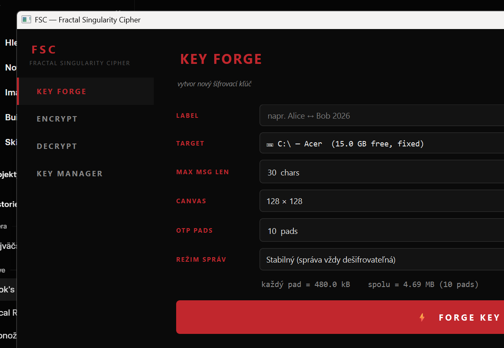

# FSC — Fractal Singularity Cipher

**A multi-domain proof-of-concept cipher that encrypts text through seven sequential physical transformations.**


---

## Overview

FSC is a research-grade cryptographic proof-of-concept that encodes plaintext by passing it through seven physically-motivated transformation layers: typographic rendering, X-ray material attenuation, radioactive isotope decay, iterated function system pixel permutation, Planck-scale quantization, Lorenz chaotic stream XOR, and a One-Time Pad. The first six layers draw on real physical equations — Beer-Lambert, nuclear decay kinetics, and the Lorenz attractor — to produce a ciphertext that visually resembles white noise and achieves near-ideal byte entropy. The final OTP layer provides Shannon information-theoretic perfect secrecy. FSC is **not** production cryptography; it is an exploration of what encryption looks like when designed around the mathematical structure of physical phenomena rather than classical number theory.

A full **PySide6 desktop app** wraps the cipher with a USB-keystore workflow: forge keys, encrypt short messages into `.fsc` envelopes, decrypt them on another machine that holds the matching key, and manage the keystore visually. Ships as a stand-alone Windows `.exe` via PyInstaller. See [**Desktop App**](#desktop-app) below.

---

## Architecture

| # | Layer | Module | Physics / Method |
|---|-------|--------|-----------------|
| 1 | **Renderer** | `core/renderer.py` | Text → vector geometry (font, size, colour, α per character) |
| 2 | **Material** | `core/material.py` | Beer-Lambert attenuation: I = I₀ · e^(−μx), μ from NIST XCOM |
| 3 | **Isotope** | `core/isotope.py` | Radioactive decay: N(t) = N₀ · e^(−λt), λ = ln 2 / t½ · two pools: `stable` (≥ 5 yr) or `ephemeral` (µs – days) |
| 4 | **Fractal** | `core/fractal.py` | IFS pixel permutation weighted by golden ratio φ = 1.6180… |
| 5 | **Quantizer** | `core/quantizer.py` | Uniform discretization to N Planck-pixel levels |
| 6 | **Blackhole** | `core/blackhole.py` | Lorenz stream XOR — σ = 10, ρ = 28, β = 8/3, RK4 integration |
| 7 | **OTP** | `core/otp.py` | XOR with truly random pad · Shannon 1949 · information-theoretic security |

The encryption pipeline is fully invertible (layers 1–5 are exact or near-exact; layers 6–7 are self-inverse by XOR). Decryption applies the inverse of each layer in reverse order given the key.

```
plaintext
    │
    ▼  [1] Renderer    text → float32 image stack  (n_chars × H × W)
    ▼  [2] Material    I_out = I_in · e^(−μx)
    ▼  [3] Isotope     N(t) = N₀ · e^(−λ · Δt)
    ▼  [4] Fractal     pixel permutation via IFS orbit scores × φ^k
    ▼  [5] Quantizer   float → uint8 levels  [0, N−1]
    ▼  [6] Blackhole   XOR with Lorenz keystream from SHAKE256(lorenz_init ∥ nonce)
    ▼  [7] OTP         XOR with pre-shared random pad  (n × H × W bytes)
    ▼  [auth]  HMAC-SHA256 prefix + random padding to 256-byte block boundary
    │
ciphertext  (authenticated bytes, entropy ≈ 8.000 bit/byte)
```

---

## Results

| Metric | Value |
|--------|-------|
| Ciphertext entropy | **7.997 / 8.000 bits** |
| Butterfly effect (Δx₀ = 1×10⁻¹⁰, 4 000 RK4 steps) | **99.6 % keystream divergence** |
| Nonce divergence (same lorenz_init, different 128-bit nonce) | **99.5 % keystream divergence** |
| Round-trip reconstruction error | **< 1 % of signal range** |
| Encrypt time | **~100 ms / 3 chars @ 128×128 canvas** |
| OTP pad (11 chars @ 128×128) | **180 KB** |

---

## Encryption layers — visual


Each column is one character. Left to right: the pixel structure of the rendered glyph survives X-ray attenuation and isotope decay (rows 1–3), is spatially destroyed by the IFS permutation (row 4), quantized (row 5), XOR-masked by the Lorenz stream into uniform noise (row 6), and finally XOR-masked again by the OTP (row 7).

---

## Installation

```bash
git clone https://github.com/petrussgm-afk/claudecrypto.git
cd claudecrypto
pip install -r requirements.txt
```

**Requirements:** Python 3.10+, numpy, scipy, matplotlib, Pillow, PySide6 (desktop app), streamlit (legacy demo), markdown (HTML paper build). PyInstaller is only needed if you want to build the Windows `.exe`.

---

## Usage

### Encrypt and decrypt

```python
from keys.keygen import generate
from core.pipeline import encrypt, decrypt

text = "HELLO WORLD"
key  = generate(text, canvas_size=128, planck_resolution=256)
# key.key_hex  →  64-char hex string (256-bit master key)

enc = encrypt(text, key)
dec = decrypt(enc, t_decrypt=key.t_encrypt)

# enc["auth_cipher"]       →  authenticated bytes (HMAC-SHA256 + 256-byte-padded)
# enc["bh_out"]["cipher"]  →  raw uint8 ciphertext array (n_chars × H × W)
# dec["geometry"]          →  list of reconstructed float32 image arrays
```

### Visualize encryption layers

```python
from viz.visualizer import visualize

visualize(enc, save_path="fsc_layers.png")
# Saves a 6-row × n_chars matplotlib figure showing each transformation stage.
```

### Interactive Streamlit demo

```bash
# macOS / Linux
streamlit run demo/app.py

# Windows (recommended)
python -m streamlit run demo/app.py
```

The demo provides a sidebar for message input and settings, a full-width layer visualization, per-character key parameter table, butterfly-effect sensitivity analysis, and a raw hex dump of the ciphertext.

---

## Desktop App

A PySide6 GUI in `app/` turns FSC into a usable end-to-end messaging tool. The app treats any folder (typically a USB drive's `fsc_keys/`) as a **keystore** — a directory of `<key_id>.fsckey` JSON manifests plus their `<key_id>_pad_NNNN.bin` One-Time Pad files. Encrypted messages are written as `.fsc` envelopes that only travel between participants who hold the matching key.

### Run from source

```bash
py app/main.py                  # opens on KEY FORGE
py app/main.py encrypt          # jump straight to a tab
py app/main.py decrypt
py app/main.py manager
```

### Build a stand-alone Windows .exe

```bash
py -m pip install pyinstaller
py build/build_windows.py --clean
# → dist/FSC/FSC.exe   (6.7 MB exe, ~715 MB bundle with PySide6+matplotlib)
```

Distribute the whole `dist/FSC/` folder. See [`build/README.md`](build/README.md) for packaging notes.

### Screens

| Tab | Purpose |
|---|---|
| **KEY FORGE** | Generate a fresh 256-bit master key + N OTP pads, save to the chosen drive's `fsc_keys/`, render a Lorenz attractor portrait of the key as a visual fingerprint. Choose **Režim správ**: `stable ∞` (long-lived isotopes, always decryptable) or `ephemeral ⏱` (self-destructs after a few half-lives). |
| **ENCRYPT** | Pick a key from the keystore, type a message (up to the key's `max_len`), encrypt with the next unused pad. Shows a 7-row layer visualization. Save as `.fsc` (marks pad used) or copy base64. |
| **DECRYPT** | Drop a `.fsc` file (or open / paste base64). The app finds the matching key on any inserted drive, reads the pad, recovers the rendered glyph images. If an ephemeral key has decayed past recovery, shows a friendly *"⏱ Táto správa expirovala"* notice instead of crashing. |
| **KEY MANAGER** | Browse all keys on a drive: label, key_id, mode, pads remaining (red ≤ 0, amber < 5, green ≥ 5). Inspect per-pad usage, refresh the Lorenz portrait, delete a key (irreversible — confirmation in Slovak), or export a public `.fscpub` profile (no secrets). |



### Wire formats

| File | What it is |
|---|---|
| `<key_id>.fsckey` | JSON manifest: 256-bit `master_key` (hex), `label`, `canvas_size`, `max_len`, `isotope_mode`, pad index. **Secret.** |
| `<key_id>_pad_NNNN.bin` | Raw `secrets.token_bytes(max_len × canvas²)` One-Time Pad. **Secret.** |
| `<msg>.fsc` | JSON envelope: `key_id`, `pad_id`, `t_encrypt`, `nonce` (b64), `cipher` (b64 of `auth_cipher`), `quant_vmin`/`vmax`/`n_levels`. The wire format Alice sends Bob. |
| `<key_id>.fscpub` | Public profile: `key_id`, `label`, `isotope_mode`, pad counts — **no key material**. Share so the other party knows which key to expect. |

The decrypt side reconstructs all per-layer parameters from `master_key + n_chars + t_encrypt + canvas_size` (deterministically — every seed is `SHAKE256(master_key ∥ purpose ∥ index)`); only the data-dependent `quant_vmin/vmax` need to travel in the envelope alongside the ciphertext and nonce. The plaintext characters never appear on disk.

---

## Key structure

A key is a `FSCKey` dataclass containing one `CharKey` per character, each holding independent seeds for all six layers, plus global parameters:

```json
{
  "text": "A",
  "canvas_size": 128,
  "planck_resolution": 256,
  "lorenz_init": [13.396, 19.069, 18.286],
  "master_key": "329b618b4533d03b339a92a797e241b6...4e0d4c36b",
  "t_encrypt": 1718000000.0,
  "isotope_mode": "stable",
  "chars": [{
    "char": "A",
    "renderer_seed": 2847103956,
    "material_seed":  491827634,
    "isotope_seed":  3102948571,
    "fractal_seed":   876234019
  }]
}
```

`master_key` is a 256-bit secret generated by `secrets.token_bytes(32)`. All per-character seeds are derived via `SHAKE256(master_key ∥ purpose ∥ index)` — no numpy RNG is involved. `lorenz_init` is likewise derived from `master_key` and then mixed with a fresh 128-bit nonce at encrypt time via SHAKE256, ensuring each message produces a unique Lorenz keystream. `isotope_mode` (`"stable"` or `"ephemeral"`) selects which pool of isotopes Layer 3 draws from — the same field is also persisted in the `.fsckey` manifest so encrypt and decrypt always pick from the matching pool. The only time-sensitive parameter is `t_encrypt`, which governs isotope decay between encryption and decryption.

---

## Security notes

> ⚠️ FSC is a **research proof-of-concept**. It has not been cryptographically audited and must not be used to protect real data.

- **No formal security proof.** The cipher is designed around physical plausibility, not algebraic hardness assumptions.
- **256-bit master key.** `generate()` uses `secrets.token_bytes(32)` by default (key space 2²⁵⁶ ≈ 1.16 × 10⁷⁷). All layer seeds are derived via SHAKE256; no numpy RNG is seeded from the key.
- **Per-message nonce.** Each encryption generates a fresh 128-bit nonce. The effective Lorenz initial condition is `SHAKE256(lorenz_init ∥ nonce)`, so reusing `lorenz_init` across messages does not reuse the keystream. Known-plaintext attack requires a nonce collision (2¹²⁸ effort).
- **HMAC-SHA256 authentication.** `encrypt()` returns an authenticated, length-padded byte blob. `decrypt()` verifies the MAC before any decryption; a wrong key or any bit flip in the ciphertext raises `ValueError` immediately.
- **Length hiding.** Ciphertext is padded to the next 256-byte block boundary with random bytes; the original size is stored in an encrypted header. Array shape is no longer directly visible in the wire format.
- **Isotope mode is explicit.** Layer 3 draws from one of two pools: `stable` (Co-60, Cs-137, Ra-226, C-14, U-235, U-238, Bi-209 — all half-lives ≥ 5 yr, default) or `ephemeral` (Po-214 at 164 µs, Ra-224 at 3.6 d, I-131 at 8 d — for self-destructing messages). The mode is chosen at key forge and persisted in the `.fsckey` manifest. Decrypting an expired ephemeral message returns a soft `status="expired"` result in the GUI instead of raising — the message is treated as intentionally gone.

---

## Project structure

```
fsc-cipher/
├── core/
│   ├── renderer.py        # Layer 1 — text → float32 image stack
│   ├── material.py        # Layer 2 — Beer-Lambert X-ray attenuation
│   ├── isotope.py         # Layer 3 — radioactive decay (stable + ephemeral pools)
│   ├── fractal.py         # Layer 4 — IFS φ-weighted pixel permutation
│   ├── quantizer.py       # Layer 5 — Planck-pixel uniform quantization
│   ├── blackhole.py       # Layer 6 — Lorenz RK4 stream XOR
│   ├── otp.py             # Layer 7 — One-Time Pad (Shannon perfect secrecy)
│   └── pipeline.py        # Orchestrates all 7 layers, encrypt + decrypt
├── keys/
│   └── keygen.py          # FSCKey / CharKey generation from master_key
├── viz/
│   └── visualizer.py      # Matplotlib 7-row layer figure → PNG (max_cols param)
├── art/
│   └── lorenz_portrait.py # Lorenz attractor fingerprint render from a master_key
├── app/                   # PySide6 desktop application
│   ├── main.py            # QMainWindow + sidebar + QStackedWidget (4 screens)
│   ├── style.qss          # Dark cyberpunk-thriller theme (black / FSC-red)
│   ├── fileformat.py      # .fsckey / .fsc / .fscpub readers + writers
│   ├── keystore.py        # USB / drive enumeration (Win32 ctypes)
│   ├── decrypt_engine.py  # Cross-process .fsc decryption (graceful expiry)
│   └── screens/
│       ├── key_forge.py   # Forge new master_key + N OTP pads → keystore
│       ├── encrypt.py     # Pick key + message → write .fsc
│       ├── decrypt.py     # Load .fsc + find key on drive → recover glyphs
│       └── key_manager.py # Browse / inspect / delete / export keys
├── demo/
│   └── app.py             # Streamlit interactive demo (legacy)
├── docs/
│   ├── FSC_paper.md       # Academic paper (arXiv cs.CR style)
│   ├── FSC_paper.html     # Built HTML version (dark theme, print-ready)
│   └── build_html.py      # markdown → HTML with MathJax
├── build/
│   ├── build_windows.py   # PyInstaller wrapper → dist/FSC/FSC.exe
│   ├── README.md          # Packaging notes
│   └── _work/             # PyInstaller intermediate output (gitignored)
├── tests/
│   ├── test_pipeline.py                  # 7-layer round-trip + security tests
│   ├── test_app_smoke.py                 # Phase 1 keystore + fileformat
│   ├── test_app_encrypt_smoke.py         # Phase 2 encrypt data path
│   ├── test_app_encrypt_integration.py   # Phase 2 widget end-to-end
│   ├── test_decrypt_engine.py            # Phase 3 cross-process decrypt
│   ├── test_app_decrypt_integration.py   # Phase 3 + wrong-key + missing-pad
│   ├── test_isotope_modes.py             # Phase 4 stable/ephemeral/expired
│   └── test_app_logic.py                 # Streamlit demo dry-run
├── fsc_layers.png         # Example visualization (text="FSC", 7 layers)
├── requirements.txt
└── README.md
```

---

## License

[](LICENSE)

```
MIT License

Copyright (c) 2026 FSC Contributors

Permission is hereby granted, free of charge, to any person obtaining a copy
of this software and associated documentation files (the "Software"), to deal
in the Software without restriction, including without limitation the rights
to use, copy, modify, merge, publish, distribute, sublicense, and/or sell
copies of the Software, and to permit persons to whom the Software is
furnished to do so, subject to the following conditions:

The above copyright notice and this permission notice shall be included in
all copies or substantial portions of the Software.

THE SOFTWARE IS PROVIDED "AS IS", WITHOUT WARRANTY OF ANY KIND, EXPRESS OR
IMPLIED, INCLUDING BUT NOT LIMITED TO THE WARRANTIES OF MERCHANTABILITY,
FITNESS FOR A PARTICULAR PURPOSE AND NONINFRINGEMENT. IN NO EVENT SHALL THE
AUTHORS OR COPYRIGHT HOLDERS BE LIABLE FOR ANY CLAIM, DAMAGES OR OTHER
LIABILITY, WHETHER IN AN ACTION OF CONTRACT, TORT OR OTHERWISE, ARISING FROM,
OUT OF OR IN CONNECTION WITH THE SOFTWARE OR THE USE OR OTHER DEALINGS IN
THE SOFTWARE.
```
